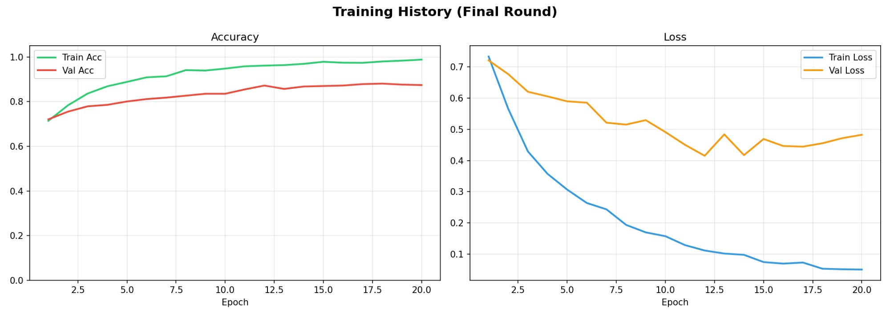
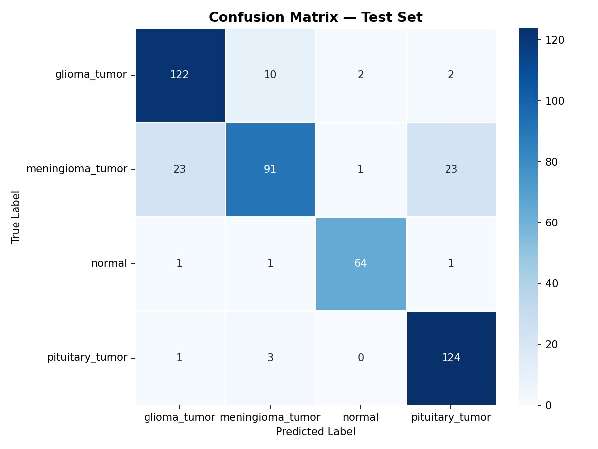

# 🧠 NeuroScan AI — Brain Tumor Classifier

<p align="center">
  
</p>

<p align="center">
  
  
  
  
  
</p>

> **NeuroScan AI** is a deep learning web application that classifies brain MRI scans into four diagnostic categories using Transfer Learning with MobileNetV2. Trained in Google Colab, served via Flask, and deployed on Render.

---

## 🌐 Live Demo

**[https://neuroscan-ai-brain-tumor-classifier.onrender.com](https://neuroscan-ai-brain-tumor-classifier.onrender.com)**
> ⚠️ Hosted on Render free tier — the app may take 30–60 seconds to wake up on first visit.

---

## 🎯 What It Does

Upload any brain MRI scan image (JPG or PNG) and the model will:

- Predict the tumor type with a confidence score
- Show probability bars for all 4 classes
- Display a clinical description of the predicted condition
- Visually distinguish between tumor and normal scans

---

## 🏷️ Classification Categories

| Class | Description |
|---|---|
| 🔴 **Glioma Tumor** | Tumors arising from glial cells in the brain or spine. Includes glioblastoma, astrocytoma, and oligodendroglioma. Accounts for ~33% of all brain tumors. |
| 🟠 **Meningioma Tumor** | Arises from the meninges surrounding the brain. Most are benign and slow-growing. The most common primary brain tumor type. |
| 🟢 **Normal** | No signs of tumor detected. Brain tissue appears healthy with no abnormal masses present in the scan. |
| 🔵 **Pituitary Tumor** | Tumors forming in the pituitary gland at the base of the brain. Most are benign adenomas that can affect hormone regulation. |

---

## 📊 Model Performance

| Metric | Value |
|---|---|
| Validation Accuracy | **88.1%** |
| Architecture | MobileNetV2 (Transfer Learning) |
| Pretrained On | ImageNet |
| Input Size | 224 × 224 × 3 (RGB) |
| Training Images | 2,165 |
| Validation Images | 462 |
| Test Images | 469 |
| Framework | TensorFlow 2.21 / Keras |

### Confusion Matrix — Test Set

<p align="center">
  
</p>

---

## 🗂️ Project Structure

```
NeuroScan-AI-Brain-Tumor-Classifier/
│
├── app.py                       # Flask application — routes, model loading, inference
│
├── templates/
│   ├── index.html               # Main classifier UI (drag & drop, results, probability bars)
│   └── about.html               # Model details, architecture, training charts
│
├── static/
│   ├── confusion_matrix.png     # Test set confusion matrix
│   ├── training_curves.png      # Accuracy & loss curves
│   └── uploads/                 # Temporary folder for uploaded MRI images
│       └── .gitkeep
│
├── model/
│   ├── brain_tumor_model.h5   # Trained MobileNetV2 model (~25MB)
│   └── class_names.json         # Ordered list of class labels
│
├── .python-version              # Pins Python 3.10.14 for Render
├── requirements.txt             # Python dependencies
├── Procfile                     # Gunicorn start command for Render
├── render.yaml                  # Render deployment config
├── .gitignore                   # Ignores venv, pycache, uploads
├── LICENSE                      # MIT License
└── README.md                    # This file
```

---

## 🛠️ Tech Stack

| Layer | Technology |
|---|---|
| Model Training | Google Colab (T4 GPU) |
| Deep Learning | TensorFlow 2.21 / Keras |
| Base Model | MobileNetV2 (ImageNet weights) |
| Backend | Python 3.10, Flask 3.1 |
| Server | Gunicorn |
| Deployment | Render.com (Free Tier) |
| Frontend | HTML5, CSS3, Vanilla JS |

---

## 🚀 Training Pipeline

The model was trained using a **two-phase transfer learning** approach in Google Colab:

### Phase 1 — Classification Head Training
- MobileNetV2 base was **fully frozen**
- Only the custom classification head was trained
- Learning rate: `1e-3` with `ReduceLROnPlateau`
- Epochs: up to 15 with `EarlyStopping`

### Phase 2 — Fine-Tuning
- Top 30 layers of MobileNetV2 were **unfrozen**
- Trained end-to-end with a lower learning rate: `5e-5`
- Epochs: up to 40 with `EarlyStopping`
- Final validation accuracy: **88.1%**

### Data Split

| Split | Images | Ratio |
|---|---|---|
| Train | 2,165 | 70% |
| Validation | 462 | 15% |
| Test | 469 | 15% |

### Augmentation (Training only)
- Horizontal flip
- Random rotation ±5°
- Random zoom ±5°

---

## ⚙️ Local Setup

### Prerequisites
- Python 3.10
- pip

### Steps

```bash
# 1. Clone the repository
git clone https://github.com/Samin-Saikia/NeuroScan-AI-Brain-Tumor-Classifier.git
cd NeuroScan-AI-Brain-Tumor-Classifier

# 2. Create a virtual environment (recommended)
python -m venv venv
source venv/bin/activate        # Linux / Mac
venv\Scripts\activate           # Windows

# 3. Install dependencies
pip install -r requirements.txt

# 4. Run the app
python app.py

# 5. Open in browser
# http://localhost:5000
```

> The model file (`brain_tumor_model.h5`) is bundled directly in the repo under `model/` — no download step required.

---

## ☁️ Deployment on Render

1. Push this repo to GitHub
2. Go to [render.com](https://render.com) → **New Web Service**
3. Connect your GitHub repository
4. Use the following settings:

| Setting | Value |
|---|---|
| Runtime | Python 3 |
| Build Command | `pip install -r requirements.txt` |
| Start Command | `gunicorn app:app --bind 0.0.0.0:${PORT:-5000} --timeout 120 --workers 1` |

5. Click **Deploy** — first deploy takes ~3–5 minutes
6. Your app is live at `https://your-app-name.onrender.com` 🎉

---

## 📦 Dependencies

```
flask
tensorflow-cpu
Pillow
numpy
werkzeug
gunicorn
```

---

## 📁 Dataset

- **Source:** [Brain Tumors 256x256 — Kaggle](https://www.kaggle.com/datasets/thomasdubail/brain-tumors-256x256)
- **Author:** Thomas Dubail
- **Images:** 256×256 grayscale MRI scans across 4 classes
- **Total samples:** ~3,096 (after 70/15/15 split)

---

## ⚠️ Medical Disclaimer

> This project is built **strictly for educational and portfolio purposes**.
>
> NeuroScan AI is **NOT** a medical device and is **NOT** intended for clinical use. It should **NOT** be used as a substitute for professional medical advice, diagnosis, or treatment. The predictions made by this model may be inaccurate.
>
> **Always consult a qualified and licensed medical professional for any health-related concerns.**

---

## 📄 License

This project is licensed under the **MIT License** — see the [LICENSE](LICENSE) file for details.

---

## 🙏 Acknowledgements

- [Thomas Dubail](https://www.kaggle.com/thomasdubail) for the Brain Tumors dataset on Kaggle
- [Google Colab](https://colab.research.google.com) for free GPU training
- [TensorFlow / Keras](https://www.tensorflow.org) for the deep learning framework
- [MobileNetV2](https://arxiv.org/abs/1801.04381) — Sandler et al., 2018
- [Render](https://render.com) for free-tier cloud deployment